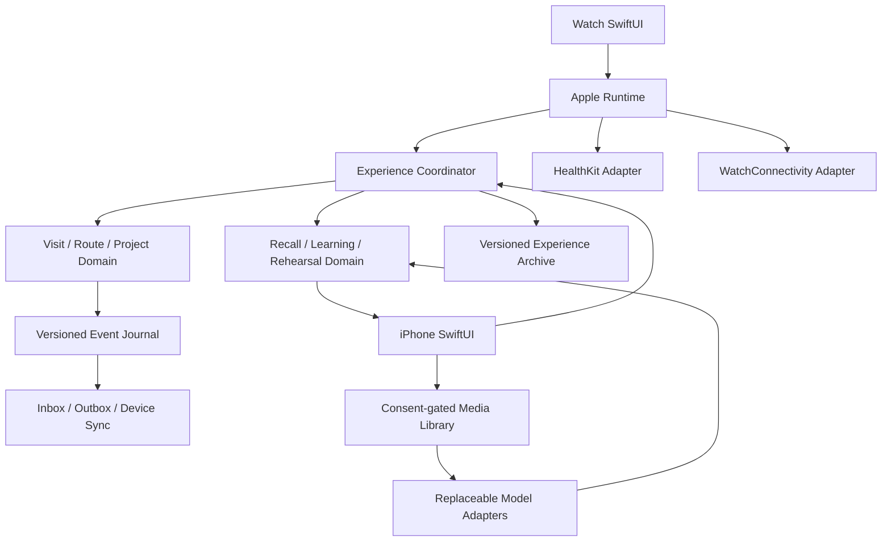

# LineWise Implementation And Validation Plan

Date: 2026-09-03

Status: End-to-end implementation foundation present; command-line behavior verification is active at 241 specifications; a 62-finding review pass is closed; `scripts/verify-apple-surfaces.sh` compiles the `os(iOS)` surfaces, the `os(watchOS)` SwiftUI branches, and all but two APIs of the HealthKit recorder; real-device and real-gym evidence remains open.

Product: LineWise / 线感

## 1. Target Outcome

The product must preserve this loop across process and device boundaries:

```text
select or create route
  -> capture low-interruption Attempt and rest anchors
  -> survive disconnection, retry, restart, and mistakes
  -> resolve uncertainty in Review Inbox
  -> save a useful MoveCue / NextSessionCue
  -> reopen it at a later GymVisit
```

Route reading, qualitative interpretation, stick-figure rehearsal, and training paths are implemented as additive suggestion surfaces. They do not replace or weaken the manual loop.

## 2. Implementation Principles

1. Domain semantics live in a platform-independent Swift module.
2. UI submits commands; it does not mutate storage rows directly.
3. A user action becomes accepted locally before cross-device delivery is attempted; local acceptance is never presented as remote durability.
4. Delivery is at least once; stable action IDs make application idempotent, and an outbox event is acknowledged only after a reliable transfer completion callback.
5. Late, conflicting, or uncertain input reopens review instead of inventing certainty.
6. HealthKit, WatchConnectivity, media, and model providers fail independently.
7. Subjective physiology remains primary; sensor summaries are optional and non-diagnostic.
8. Model output is always a suggestion with provider provenance.
9. Export, deletion, consent, and correction are product behavior, not cleanup work.
10. Platform behavior is not called verified until exercised with the required SDK, signing, and devices.
11. Intelligence is optional and user-opened; the default product surface proves the manual P0 loop first.

## 3. Current Architecture



### Domain

`LineWiseDomain` owns identifiers, commands, reducers, replay, corrections, rest, recall, learning, physiology context, route rehearsal, pose solving, Plan/Actual comparison, qualitative analysis, and personal-dataset models. It imports no Apple UI or HealthKit frameworks.

### Application

`LineWiseApplication` owns app-level orchestration, undo eligibility, route selection, failure-review atomicity, next-session recall, rehearsal coordination, durable experience archive, and opt-in field-evidence recording.

### Apple adapters

`LineWiseAppleAdapters` owns SwiftUI surfaces, the local-first Apple runtime, HealthKit workout mapping, WatchConnectivity transport, stable device bootstrap, and the local route-media library.

### AI adapters

`LineWiseAIAdapters` owns replaceable HTTP boundaries for route reading, media-aware route reading, rehearsal suggestion, and qualitative interpretation. Credentials are injected at runtime. Filesystem references are resolved locally and are never included in the request payload.

## 4. Implemented Slices

### A. Manual domain loop

- RouteCard, Project, GymVisit, Attempt, result, Rest, Review, and exact-target Undo.
- Business-time projection under reordered delivery.
- Explicit reconciliation for equal-time opposing results and invalid dependencies.
- Repeatable Project cycles and route successor behavior.
- Route rename, archive/restore, availability correction, merge/unmerge, attempt reassignment, and project archive with audit history.

### B. Persistence and synchronization

- In-memory and Foundation file stores behind shared contracts.
- Schema v1 plus v0 migration fixtures, deterministic replay, and atomic replacement.
- Checkpointed incremental replay that compacts fold work without truncating the event log, so an event arriving out of order still reprojects from an earlier checkpoint.
- Forward-compatible experience-archive decoding for archives written by an older same-schema writer.
- Stable device envelopes, inbox/outbox, completion-confirmed acknowledgement, retry, duplicate suppression, and origin-sequence conflict handling.
- Role-scoped durable WatchConnectivity payload inboxes that are consumed only after repository persistence succeeds.
- Export, scoped delete, and redacted diagnostics.
- Experience archive covering Recall, Learning, Physiology, Rehearsal, and Rest state. A change that touches only this archive is all-or-nothing. A capture command is not: its event reaches the durable journal before the archive save runs, so a failed save commits the coordinator that matches the journal and surfaces the error rather than leaving an Attempt the user can see and cannot Undo.

### C. Recall, teaching, and physiology

- Explicit Review Inbox branches.
- Stable reconciliation of unresolved/unassigned Attempts from ended synced visits, including restart and persistence-failure retry.
- Atomic FailureEpisode → MoveCue → NextSessionCue capture.
- Cue complete/defer/dismiss/reopen lifecycle.
- Approved MicroDrill catalog, TrainingPath, and ProofCheck.
- Subjective fatigue/pump plus optional HealthKit workout summary with provenance and non-diagnostic copy.
- Heart-rate coverage accumulated from collected samples into a `0...1` fraction, unioning overlapping windows and clamping to the workout duration.

### D. Route rehearsal

- Editable route scene and four-limb contacts.
- Contact locks and deterministic 2D stick-figure solver.
- Keyframe insert, duplicate, delete, reorder, downstream stale propagation, and recompute.
- Plan and Actual tracks, scrub, single-step, continuous playback, and loop.
- Per-step MovementIntent covering purpose, movement family, authored rhythm, felt cue, uncertainty, and automatic needs-review state after relevant contact changes.
- Current one-to-three-step practice selection, bounded segment looping, and pinned StickFigureCue input to qualitative analysis.
- Deterministic comparison for limb, torso, and timing evidence.
- Codable pinned StickFigureCue replay over a bounded move range.

### E. Media, qualitative analysis, and model seams

- Source/derived media lineage, purpose, consent, hash, quality, retention, annotations, corrections, tombstones, and manifest export.
- Path-contained local byte loading and explicit model-processing consent.
- Deterministic-local and HTTP route-analysis providers.
- Qualitative analysis requests pin only the confirmed FailureEpisode and MoveCue history belonging to the analyzed RouteCard, keeping the failure-to-cue chain on one route.
- Explicit media-consent then model-run flow, with suggested RouteRead attachment and durable route-read provenance.
- Attempt-linked Actual drafts copied from Plan as `userAuthored + manual`, never mislabeled as observed evidence.
- Typed cancellation, timeout, HTTP, response, consent, and integrity failures.
- Adapter-enforced `suggested + modelAdapter` provenance.

### F. Apple experience

- iPhone visit/review/recall/physiology/rehearsal experience surface.
- Watch Attempt, result, Undo, Rest, elapsed-time, and end-visit surface.
- Explicit Health recording enablement; manual Visit start never requests HealthKit authorization by itself.
- HealthKit unavailable/denied/failure degradation without rollback of app-private visits.
- WatchConnectivity enqueue/pull/completion-ack behavior, durable inbound payloads, and persistent device identity.
- Manual P0 surfaces shown by default, with route intelligence behind an explicit user-opened workspace.
- Dynamic Type, VoiceOver labels, and text-plus-symbol state communication.

### G. Field evidence

- Disabled by default.
- Explicit consent per field-test session.
- Controlled event categories only; no route labels, health values, media, free text, or stable user identity.
- Numerator, denominator, source event, missing-data behavior, and privacy scope for each metric.
- Atomic local store, export, delete, reopen idempotency, and future/corrupt schema rejection.

## 5. Verification Commands

Run the public-interface specifications:

```sh
swift run LineWiseDomainSpec
swift run LineWiseApplicationSpec
swift run LineWiseAppleAdaptersSpec
swift run LineWiseAIAdaptersSpec
swift run linewise-demo
```

Repeat with `-c release`, then run:

```sh
swift build
swift build -c release
swift format lint --recursive --strict Sources Specs Package.swift
git diff --check
```

The executable specification targets are used because the currently selected Command Line Tools installation does not expose the full Xcode test runtime. They exercise only public module interfaces and exit nonzero on a violated expectation.

Current baseline: 118 Domain + 51 Application + 55 Apple adapter + 17 AI adapter behaviors = 241 passing specifications in both Debug and Release, plus the end-to-end command-line demo.

Each suite derives its total from the specifications it ran rather than a hardcoded constant, so a removed or skipped specification lowers the count instead of silently reporting the old number.

These commands do not cover all of the platform-gated Apple code. The SwiftUI surfaces in `ExperienceSurfaces.swift` and `RehearsalSurfaces.swift` are gated only on `canImport(SwiftUI)`, which is true on macOS, so `swift build` does compile them. What it skips is `os(iOS)`, `os(watchOS)`, `canImport(HealthKit)`, `canImport(WatchConnectivity)`, and `canImport(PhotosUI)`: the Watch and iPhone capture surfaces, the HealthKit workout recorder, the WatchConnectivity transport, the photo import surface, and both app entry points.

Add this build, which reaches most of that set without a full Xcode installation. The Command Line Tools macOS SDK bundles Catalyst iOSSupport, including HealthKit, WatchConnectivity, and PhotosUI, so the triple makes `os(iOS)` true:

```sh
SDK=$(xcrun --sdk macosx --show-sdk-path)
swift build --triple x86_64-apple-ios18.0-macabi \
  -Xswiftc -F -Xswiftc "$SDK/System/iOSSupport/System/Library/Frameworks" \
  -Xswiftc -I -Xswiftc "$SDK/System/iOSSupport/usr/lib/swift"
```

This build is what first caught the eight `static member 'now'` errors in `AppleSurfaces.swift`. `scripts/verify-apple-surfaces.sh` wraps it as one of four stages and is what to run for any Apple-surface change:

1. `swift build` — the platform-independent modules and the SwiftUI surfaces gated on bare `canImport(SwiftUI)`.
2. The Catalyst triple above — the `os(iOS)` capture surfaces and the WatchConnectivity transport.
3. The `#if os(watchOS)` SwiftUI branches, forced active and built for macOS. No triple here makes `os(watchOS)` true, and a type error in an inactive branch is invisible to `swiftc -parse` and `-typecheck` alike, so making the branch active is the only way to reach it.
4. The HealthKit recorder, type-checked against Catalyst. Exactly two APIs it calls are `API_UNAVAILABLE(macCatalyst)`; the stage tolerates those and fails on a third.

## 6. Apple Validation Procedure

The repository includes an iPhone target and a single-target watchOS companion in `LineWise.xcodeproj`. A platform validation pass must use a full Xcode installation and signed devices.

The current toolchain cannot start a device pass: `xcodebuild` reports that the active developer directory is a Command Line Tools instance, and neither the `watchos` nor the `iphoneos` SDK can be located. It can, however, compile the `os(iOS)` code through the Catalyst triple in Section 5, which is how the first two Apple-surface defects were found. Compilation and device validation are separate gates; clearing the first does not touch the second.

Required scenarios:

- first launch, no account, and no optional permission;
- HealthKit granted, denied, revoked, and interrupted workout lifecycle;
- Watch captures while the phone is unavailable;
- Watch/iPhone restart with pending outbox events;
- duplicate delivery, delayed delivery, and acknowledgement loss;
- active Rest reopening after Watch restart;
- low-power behavior, VoiceOver, Dynamic Type, and tap-target review;
- export, revoke, media delete, and application-data delete.

Simulator or syntax checks may find integration problems, but they do not close the real-device gate.

## 7. Field Validation Procedure

The manual P0 loop is the first product gate even though broader features are present in code.

Measure at minimum:

- RouteCard creation completion time;
- primary Attempt-flow tap burden;
- accepted-action persistence reliability;
- Review Inbox completion and skip rates;
- NextSessionCue presentation and user action;
- route and attempt correction counts;
- subjective usefulness of the reopened cue.

For route intelligence, compare manual, deterministic-local, and remote-suggestion paths separately. Do not promote photo/video quality, fatigue inference, movement safety, or training efficacy claims from implementation tests alone.

## 8. Remaining Evidence, Not Deferred Implementation

The main open work is external validation:

- install full Xcode so the `os(watchOS)` branches compile and the Apple targets can be run with signing on a paired Watch/iPhone;
- exercise a configured remote model endpoint with consented representative media;
- complete the real-gym P0 gate and record its denominators;
- test route analysis and stick-figure rehearsal with representative climbers;
- revise the product only from observed friction, correction patterns, and explicit user feedback.

If a platform or study dependency is unavailable, record that boundary explicitly. Do not substitute documentation, simulator behavior, or passing pure-Swift specifications for the missing evidence.

## 9. Definition Of Done

Code implementation is done when all public-interface specifications pass in Debug and Release and the Apple project remains structurally valid.

P0 product validation is done only when the manual loop works in real gym visits, accepted actions survive device/process disruption, review produces or explicitly skips a useful cue, and a later visit reopens that memory.

AI, physiology, or training claims are done only after their own consented evaluation gates. They remain optional enhancements to a trustworthy manual core.
