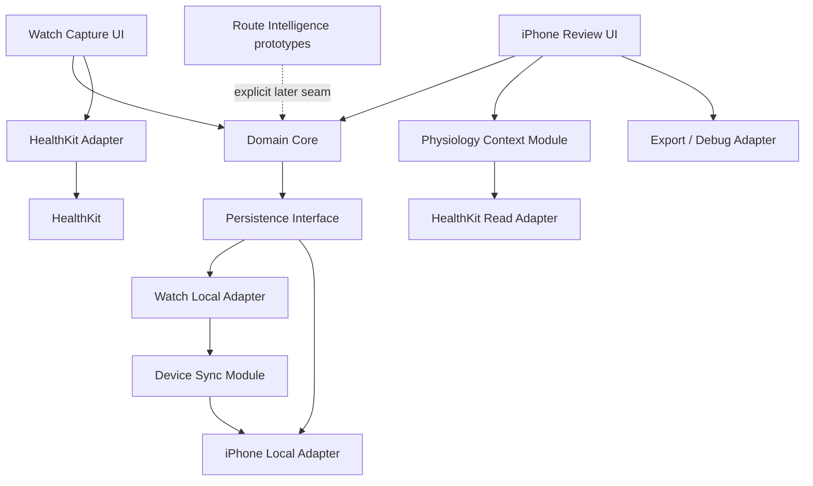

# LineWise P0 Implementation Plan

Date: 2026-08-11

Status: Active; S0 semantics settled and Phase A domain foundation started

Product: LineWise / 线感

Scope: Manual Gym Visit Memory core, Apple Watch capture, iPhone review, local-first reliability, and bounded parallel prototypes

## 1. Outcome

The first production implementation must prove this loop on real gym visits:

```text
select or create route
  -> record low-interruption Attempt anchors
  -> survive disconnection and mistakes
  -> resolve the visit in Review Inbox
  -> save one useful NextSessionCue
  -> reopen it at a later GymVisit
```

The implementation is not complete when a workout summary renders. It is complete when route memory survives a visit boundary and changes what the user remembers or tries next.

## 2. Preconditions

Production issue execution begins only after the focused contracts settle:

- Attempt and result semantics;
- RouteCard and Project lifecycle;
- GymVisit versus HealthKit workout ownership;
- Review Inbox lifecycle;
- degraded iPhone-only and no-HealthKit paths;
- physiology retention and claim boundaries.

The manual RouteRehearsal X0 may continue as a throwaway prototype in parallel because it does not modify or block the P0 production seam.

## 3. Implementation Principles

1. **Domain first.** App-private bouldering semantics live in a platform-independent Swift module.
2. **One command, one explicit outcome.** UI layers never mutate persistence records directly.
3. **Local event durability before sync.** A user action is accepted only after it is durably queued on the originating device.
4. **At-least-once delivery, idempotent application.** Connectivity may duplicate or reorder envelopes.
5. **Review is a domain lifecycle.** It is not a screen-only filter.
6. **Adapters fail independently.** HealthKit, WatchConnectivity, media, and future cloud operations cannot erase app-private events.
7. **Manual core without optional systems.** The iPhone-only, no-account, no-photo, no-AI, no-HealthKit path remains testable.
8. **Test at module interfaces.** Domain tests assert observable transitions; adapter tests assert contract behavior; UI tests assert user outcomes.
9. **Real-device truth for Watch behavior.** Simulator results never close Watch/HealthKit/connectivity gates.
10. **No speculative AI seam in P0.** Provenance is supported, but model-provider interfaces are created only when an assisted prototype has two real adapters or a production and test adapter.

## 4. Module Architecture



### 4.1 Domain Core

Owns:

- identifiers and value types;
- RouteCard and Project lifecycle;
- GymVisit state;
- Attempt, result, RestInterval, and Undo semantics;
- Review Inbox state;
- FailureEpisode, MoveCue, NextSessionCue, and ProofCheck links;
- command validation and domain events;
- idempotent event application and conflict outcomes.

External interface:

- accept a domain command against a known state/version;
- return a new state, emitted durable events, and an explicit accepted/rejected/no-op outcome;
- project durable events into user-facing read models.

The interface does not expose database rows, WatchConnectivity payloads, HealthKit objects, or view state.

### 4.2 Persistence Module

Owns:

- atomic storage of accepted events and current projections;
- schema version and migration;
- local outbox/inbox;
- tombstones and deletion state;
- crash-safe reopen.

Interface:

- transact a domain transition;
- load one aggregate or visit projection;
- list pending review and pending sync;
- export/delete within a bounded user scope.

Adapters:

- in-memory adapter for domain/integration tests;
- production local-store adapter;
- migration fixture adapter or harness.

### 4.3 Device Sync Module

Owns:

- stable event envelopes;
- retry, acknowledgement, duplicate suppression, and ordering metadata;
- delayed-event reconciliation;
- user-visible sync health projection.

Interface:

- enqueue an accepted local envelope;
- receive zero or more remote envelopes;
- return acknowledgements and reconciliation outcomes;
- expose pending, delayed, failed, and reconciled counts without inventing real-time guarantees.

WatchConnectivity is an adapter at this seam.

### 4.4 Watch Capture Module

Owns:

- the minimum current-visit read model;
- one-tap Attempt capture;
- optional result action;
- Undo feedback;
- route/project switching;
- rest timer presentation and haptics;
- durable offline state and recovery entry.

It does not own route editing, review interpretation, failure taxonomy, or sync truth beyond the status supplied by the sync module.

### 4.5 iPhone Review Module

Owns:

- RouteCard creation/search/editing;
- Project list and route-successor behavior;
- pending and completed review views;
- attempt-to-route repair;
- result confirmation;
- FailureEpisode, MoveCue, and NextSessionCue editing;
- late-arriving event reconciliation prompts;
- next-visit recall entry.

It consumes domain projections and submits commands. It does not bypass the domain core to edit storage.

### 4.6 HealthKit Workout Adapter

Owns:

- authorization interaction at the Apple framework seam;
- workout-session lifecycle;
- best-effort write/read behavior;
- mapping adapter errors to bounded app outcomes.

It does not own GymVisit identity or Attempt semantics. A HealthKit failure cannot roll back an accepted app visit.

### 4.7 Physiology Context Module

Owns:

- source-aware visit summaries;
- subjective fatigue and forearm-pump reports;
- derived value/version provenance;
- permission-aware empty states;
- retention and deletion behavior defined by the physiology contract.

It does not expose raw HealthKit framework types to the review module and does not output medical, grip-force, muscle-activation, or recovery-readiness conclusions.

## 5. Proposed Repository Shape

```text
linewise/
├── Package.swift                         # pure/testable Swift foundation
├── Sources/
│   ├── LineWiseDomain/                  # commands, events, state, projections
│   ├── LineWisePersistence/             # storage interface + in-memory adapter first
│   └── LineWiseSync/                    # envelopes and reconciliation
├── Specs/
│   └── LineWiseDomainSpec/              # current public-interface executable specifications
├── Tests/                                # standard test targets after full Xcode/test runtime is available
├── app/                                 # Xcode iPhone/Watch workspace when full SDK exists
│   ├── iPhone/
│   ├── Watch/
│   └── SharedAdapters/
├── prototypes/                          # explicitly throwaway evidence artifacts
└── docs/
```

The pure package is not a substitute for the future Xcode workspace. It is the shared business-logic foundation that can be compiled and tested before Watch UI and SDK adapters exist.

## 6. Delivery Order

### Phase A: Contract And Domain Foundation

Goal: one executable interpretation of the settled P0 contract.

Deliver:

- canonical IDs, timestamps, sources, and provenance value types;
- RouteCard/Project state;
- GymVisit and Attempt state transitions;
- explicit result confirmation and Undo behavior;
- domain error/no-op outcomes;
- deterministic projections for current visit and Review Inbox;
- behavior tests at the Domain Core interface.

Exit:

- every acceptance scenario from the P0 domain contract passes;
- no platform framework is imported by the domain target;
- duplicate and delayed event fixtures produce deterministic results.

### Phase B: Persistence And Reconciliation

Goal: accepted user actions survive process death, duplication, and temporary device separation.

Deliver:

- in-memory adapter and contract tests;
- production local persistence choice and schema;
- atomic event plus projection transaction;
- outbox/inbox and acknowledgement state;
- import/export fixtures;
- migration v0 -> v1 rehearsal;
- crash/reopen harness.

Exit:

- replaying an event stream yields the same projection;
- duplicate delivery is a visible no-op;
- a late event either reopens review or creates an explicit reconciliation item;
- deletion and export behavior match the data contracts.

### Phase C: iPhone Manual Loop

Goal: complete P0 without Watch or HealthKit.

Deliver:

- first-use/no-account path;
- RouteCard and Project views;
- iPhone quick Attempt capture;
- GymVisit start/end;
- Review Inbox and batch repair;
- FailureEpisode, MoveCue, NextSessionCue;
- next-visit reopen;
- empty, error, timeout, and deleted-route states;
- accessibility/localization baseline.

Exit:

- a scripted iPhone-only visit completes end-to-end;
- no photo or permission is required;
- field user can create a minimal RouteCard within the gate target;
- review can be skipped and resumed without data loss.

### Phase D: Watch Capture

Goal: add less interruption than iPhone capture while preserving the same domain semantics.

Deliver:

- paired Watch target;
- local visit continuation and route context;
- one-tap Attempt, optional result, Undo, and rest view;
- durable local queue;
- WatchConnectivity adapter;
- disconnect/reconnect/restart flows;
- low-power degradation;
- VoiceOver and large-target checks.

Exit:

- paired-device tests pass on real hardware;
- phone-absent capture survives reconnect;
- duplicate deliveries do not create attempts;
- action burden and annoyance pass the field gate.

### Phase E: HealthKit And Physiology Context

Goal: add optional workout/system context without weakening the manual core.

Deliver:

- contextual authorization flow;
- HealthKit workout-session adapter;
- best-effort workout write and retry projection;
- permission-aware heart-rate/effort summary;
- subjective fatigue/pump entry;
- data-source and derivation disclosure;
- retention, export, revoke, and delete flows;
- separately gated research-mode motion capture, if still justified.

Exit:

- denied authorization path remains complete;
- HealthKit failures do not lose GymVisit data;
- copy and summaries stay within the claim contract;
- real-device battery and missing-sample cases are recorded.

### Phase F: P0.5 Dataset Mode

Goal: collect corrected route evidence with acceptable burden.

Deliver:

- explicit camera or limited-picker flow;
- wall-context and route-focused media;
- quality state;
- manual hold/start/top corrections;
- source and CorrectionEvent provenance;
- privacy review for unrelated people;
- export/delete coverage.

Exit:

- capture and correction pass field-burden gates;
- unusable or privacy-sensitive media can be discarded completely;
- dataset thresholds are labeled by purpose rather than treated as a single magic number.

## 7. Issue-Ready Backlog

The following backlog slices were used to cut the live GitHub issues after S0. They are intentionally vertical and independently verifiable.

### Live Issue Index

The first execution set was opened on 2026-08-11. `ready-for-agent` means the written contract is sufficient for another bounded implementation pass; `needs-info` means full Xcode, real devices, real users, consent copy, or dataset ownership is still required.

| Issue | Execution slice | Current readiness |
| --- | --- | --- |
| [#1](https://github.com/WILLOSCAR/linewise/issues/1) | Pure Swift domain foundation review | `ready-for-human` |
| [#2](https://github.com/WILLOSCAR/linewise/issues/2) | Review Inbox and recall objects | `ready-for-agent` |
| [#3](https://github.com/WILLOSCAR/linewise/issues/3) | Persistence, replay, and migration | `ready-for-agent` |
| [#4](https://github.com/WILLOSCAR/linewise/issues/4) | Device event envelopes and reconciliation | `ready-for-agent` |
| [#5](https://github.com/WILLOSCAR/linewise/issues/5) | iPhone-only manual vertical slice | `needs-info`: full Xcode |
| [#6](https://github.com/WILLOSCAR/linewise/issues/6) | Watch offline capture | `needs-info`: full Xcode and paired devices |
| [#7](https://github.com/WILLOSCAR/linewise/issues/7) | HealthKit and physiology | `needs-info`: consent review and real devices |
| [#8](https://github.com/WILLOSCAR/linewise/issues/8) | Export, deletion, and debug bundle | `ready-for-agent` |
| [#9](https://github.com/WILLOSCAR/linewise/issues/9) | Field-validation instrumentation | `needs-info`: study operations |
| [#10](https://github.com/WILLOSCAR/linewise/issues/10) | P0.5 route-media dataset | `needs-info`: rights and consent |
| [#11](https://github.com/WILLOSCAR/linewise/issues/11) | RouteRehearsal X0 formative evaluation | `needs-info`: representative participants |

### P0-001 — Bootstrap Pure Swift Domain Package

Outcome:

- `swift run LineWiseDomainSpec` runs domain capabilities in the current command-line environment;
- no Apple UI or health framework dependency;
- CI command and local command are documented.

Acceptance:

- package compiles under the repository's Swift tools declaration;
- one public Domain Core interface exists;
- tests import only the public module.

### P0-002 — RouteCard And Project Lifecycle

Outcome:

- create a RouteCard, promote it to a Project, record send history, archive/reopen, mark gone, and create a successor after reset.

Acceptance:

- all legal and illegal transitions match the focused contract;
- historical attempts keep their original RouteCard identity;
- merge/version behavior is explicit and tested through the public interface.

### P0-003 — Attempt Capture, Result, And Undo

Outcome:

- one command records one Attempt anchor;
- optional completion result and review confirmation use one canonical model;
- Undo reverses the latest eligible local action without erasing audit history.

Acceptance:

- unresolved does not become failure automatically;
- duplicate capture ID is a no-op;
- result conflicts return an explicit reconciliation outcome;
- end-of-visit behavior is deterministic.

### P0-004 — GymVisit And Route Switching

Outcome:

- start, resume, switch route, continue without route, and end a GymVisit.

Acceptance:

- route switches do not rewrite prior attempts;
- crash/reopen restores an unambiguous visit state;
- overlapping visit commands are rejected or reconciled by contract.

### P0-005 — Review Inbox Lifecycle

Outcome:

- unresolved attempts and late events can be confirmed, edited, skipped, reopened, or completed.

Acceptance:

- a late Watch event after review completion has an explicit outcome;
- bulk operations remain reversible where the contract requires;
- completion state distinguishes fully resolved from intentionally skipped.

### P0-006 — FailureEpisode To NextSessionCue

Outcome:

- a reviewed attempt can create one primary FailureEpisode, a MoveCue, and a lifecycle-managed NextSessionCue.

Acceptance:

- each object retains its RouteCard and source relationship;
- cues can be deferred, completed, dismissed, and reopened;
- a gone route does not delete historical cues.

### P0-007 — Local Persistence Contract

Outcome:

- Domain Core transitions persist atomically and reopen after simulated process death.

Acceptance:

- in-memory and production adapters pass the same contract suite;
- failed writes do not report an accepted user action;
- migration and deletion fixtures are versioned.

### P0-008 — Device Event Envelope And Reconciliation

Outcome:

- Watch/iPhone events survive duplication, reordering, delay, and retry.

Acceptance:

- stable IDs and source timestamps are preserved;
- acknowledgements are idempotent;
- reconciliation exposes user action only when semantics conflict.

### P0-009 — iPhone Manual Visit Vertical Slice

Outcome:

- a user completes RouteCard -> Attempt -> review -> NextSessionCue without Watch.

Acceptance:

- no account, HealthKit, photo, or network required;
- first-use and empty states are included;
- UI automation covers the complete scripted loop.

### P0-010 — Watch Offline Capture Vertical Slice

Outcome:

- a user captures attempts and Undo while the phone is unavailable, then reconciles later.

Acceptance:

- real Watch/iPhone validation;
- local durability before feedback;
- restart and low-power cases included.

### P0-011 — Optional HealthKit Workout Adapter

Outcome:

- a Watch workout can be recorded when authorized while the app visit remains independent.

Acceptance:

- denied, revoked, failed-write, and missing-sample paths;
- no route/attempt semantics stored as HealthKit truth;
- real-device lifecycle evidence.

### P0-012 — Export, Delete, And Debug Bundle

Outcome:

- the user can export owned records, delete them by defined scope, and create a redacted diagnostic bundle.

Acceptance:

- source/derived/provenance relationships are represented;
- tombstones and synced copies follow the deletion contract;
- debug bundle excludes health/media data unless explicitly selected.

### P0-013 — Field Validation Instrumentation

Outcome:

- the product can measure RouteCard time, tap burden, save reliability, review, recall, and correction without hidden behavioral profiling.

Acceptance:

- every metric has a local definition and denominator;
- optional analytics consent is separated from core storage;
- a manual export path supports early tests without an analytics SDK.

### X0-001 — Manual RouteRehearsal Prototype

Outcome:

- validate contacts, keyframes, step debugging, and continuous playback using a throwaway single-file prototype.

Acceptance:

- no production dependency;
- complete state is visible;
- awkward cases expose silent contact changes, stale downstream steps, and plan/actual differences;
- verdict is captured before any implementation extraction.

## 8. Test Strategy

### Domain Core Seam

Test observable command outcomes and projected state through the public interface.

The selected Command Line Tools installation currently exposes neither `XCTest` nor Swift Testing modules to SwiftPM. The first behavior suite is therefore an executable specification target that imports only the public `LineWiseDomain` product and fails the process on a violated expectation. Move the same scenario table into a standard test target when full Xcode supplies the test runtime; do not weaken or rewrite the behavioral seam during that migration.

Priority scenarios:

- first Attempt in an open visit;
- optional result confirmation;
- duplicate command ID;
- Undo after capture and after result;
- route switch between attempts;
- end with unresolved attempts;
- late result after visit end;
- conflicting results from two devices;
- route gone after historical attempts;
- review completion followed by late event;
- replay of the same durable event set in a different delivery order where ordering is not semantically relevant.

Do not test reducer internals, private helper calls, storage rows, or UI state through side channels.

### Persistence Seam

Run one contract suite against the in-memory and production adapters:

- atomic accepted transition;
- failed transaction;
- reopen;
- replay;
- migration;
- export;
- scoped deletion;
- outbox acknowledgement.

### Adapter Tests

- WatchConnectivity payload encode/decode and retry with a fake adapter;
- HealthKit mapping with an injected adapter where possible, plus mandatory real-device runs;
- time-based rest and cue behavior with an injected clock;
- media deletion and orphan cleanup with a temporary local store.

### UI And Field Tests

- scripted iPhone-only loop;
- VoiceOver and Dynamic Type baseline;
- Watch tap count and Undo recognition;
- phone absent, watch restart, low power, delayed sync;
- real visit measurement against MVP gates.

## 9. Data Migration And Versioning

From the first persisted schema:

- every record and event carries a schema version;
- stable IDs do not depend on database row IDs;
- enum values decode unknown future cases into a recoverable unsupported state;
- user-authored source values are never overwritten by a derived projection;
- migrations are rehearsed on immutable fixtures;
- export format version is separate from storage schema version;
- AI/model versioning remains outside P0 domain state except thin suggestion provenance.

## 10. Observability And Field Evidence

Early private-alpha evidence should be inspectable without a remote analytics dependency.

Required local counters and timings:

- RouteCard creation start/complete/cancel;
- accepted Attempt actions and Undo;
- unresolved attempts at visit end;
- local-save failures;
- sync queued/delayed/duplicate/conflict outcomes;
- review started/completed/skipped/reopened;
- MoveCue and NextSessionCue creation;
- next-visit cue presentation and user action;
- HealthKit authorization/write status without sample values in generic diagnostics;
- battery and real-device test notes captured manually.

Every metric definition must state its event source, denominator, missing-data behavior, and privacy scope.

## 11. Local Tooling State

As checked on 2026-08-11:

- the machine can build and run Swift 6.3 command-line packages;
- the selected developer directory is Command Line Tools;
- a watchOS SDK is not available through the selected toolchain.
- the selected command-line test runtime does not expose `XCTest` or Swift Testing modules, so the repository currently runs public-interface executable specifications instead.

Therefore:

- Phase A pure Swift work is locally executable through `swift run LineWiseDomainSpec`;
- watchOS, HealthKit, WatchConnectivity, simulator, and paired-device work cannot be claimed verified in the current environment;
- selecting/installing full Xcode is an environment prerequisite before Phase D/E implementation and validation.

## 12. First Execution Batch

Once S0 is signed off, execute in this order:

1. P0-001 bootstrap package — started and executable;
2. P0-003 first vertical TDD slice for Attempt, result, idempotency, exact Undo, and delayed dependency handling — started with passing specifications;
3. P0-002 RouteCard/Project lifecycle;
4. P0-004 GymVisit and route switching;
5. P0-005 Review Inbox;
6. P0-006 recall objects;
7. P0-007 persistence contract;
8. P0-009 iPhone-only vertical slice;
9. install/select full Xcode and begin P0-008/P0-010/P0-011;
10. run the field gate before P0.5 production work.

X0-001 runs independently and may influence later visual modules, but it does not change this order.

## 13. Current Implementation Progress

Completed in the first foundation batch:

- Swift package and public `LineWiseDomain` product;
- stable typed identifiers and millisecond `Instant` value;
- pure `VisitMemory.apply(command, to:) -> VisitTransition` interface;
- one open GymVisit, end, review start/complete, and late-event `needs_recheck` behavior;
- one-tap unresolved Attempt capture;
- explicit Send and Not Sent result changes without additional Attempt count;
- stable action-ID idempotency and conflicting-ID detection;
- exact-target Undo for Attempt and Send actions;
- pending Send/Undo resolution when dependencies arrive out of order;
- deterministic result projection by source business time rather than delivery order;
- explicit reconciliation when opposing user-confirmed results have indistinguishable business time;
- reviewed visits returning to `needs_recheck` after a late Attempt, result, or retraction;
- conflicting cross-cycle corrections, dependent Undo, and results targeting retracted Attempts retained as reconciliation items and reopening completed review;
- rejection of reused durable GymVisit identities;
- RouteCard identity, availability, successor-after-reset, and independent Project cycles;
- sent Project support projection, reversible correction, gone-route dominance, and an explicit conflict instead of overlapping active cycles;
- 27 passing debug and release public-interface specifications for the implemented behaviors.

Not yet implemented:

- durable persistence, event export, and migration;
- route archive/merge/unmerge and general correction commands;
- FailureEpisode, MoveCue, NextSessionCue, and Inbox item aggregates;
- Watch/iPhone UI targets and adapters;
- HealthKit, WatchConnectivity, physiology, and media adapters;
- real-device and real-gym evidence.

## 14. Definition Of P0 Implementation Complete

P0 is implementation-complete only when:

- the iPhone-only loop works without optional permissions;
- the Watch loop works on a real paired device and measurably lowers capture burden;
- accepted actions survive process death and phone absence;
- duplicate and delayed events reconcile without silent data corruption;
- Review Inbox produces a useful NextSessionCue or an explicit skip;
- a later visit reopens prior route memory;
- export, deletion, and permission revocation are verified;
- privacy and claim copy match the focused contracts;
- the required field metrics are collected over real gym visits;
- any unverified platform behavior is labeled pending rather than inferred from simulator or documentation.
