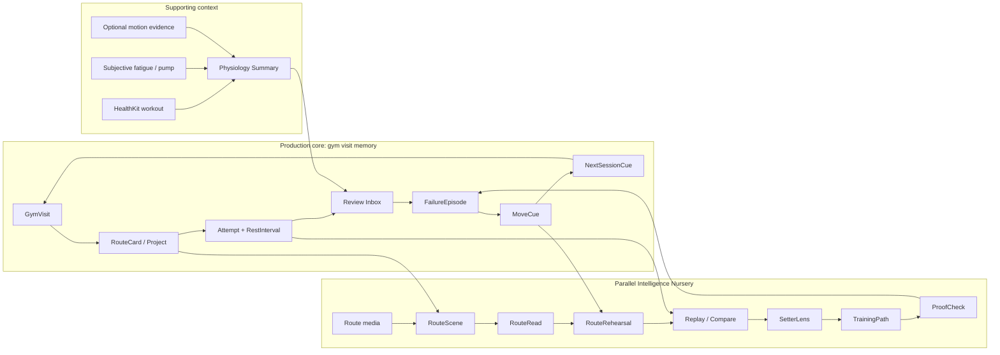

# LineWise Product Requirements Map v0

Date: 2026-08-11

Status: Active integration map; S0 semantics settled, field validation and platform adapters still pending

Product: LineWise / 线感

Scope: Indoor bouldering, Apple Watch + iPhone, manual product core plus parallel Intelligence Nursery

## 1. Purpose

LineWise now has enough product material that adding another broad PRD would create duplication instead of clarity. This document is the navigation and dependency map across the product.

It answers five questions:

1. Which user loop is the production core?
2. Which modules exist, and what does each module own?
3. Which interfaces connect those modules?
4. What may be explored in parallel without becoming a release dependency?
5. Which unresolved contracts block implementation?

This map does not replace the detailed PRD, platform contract, data contract, AI requirements, or ADRs. It tells a contributor where each decision belongs and what must be true before work is promoted.

## 2. Source Priority

When two documents disagree, use this order:

1. accepted ADRs for durable decisions;
2. `CONTEXT.md` for canonical domain language;
3. focused active contracts for one module or cross-cutting concern;
4. this requirements map for ownership, dependency, and phase;
5. the active P0/P0.5 PRD and MVP gate;
6. initialization and project-background documents;
7. historical research as evidence, not current product truth.

An unresolved conflict must be named in Section 12. It must not be silently resolved by whichever document was edited most recently.

## 3. Product Topology

LineWise is three connected product lines, not one oversized feature list.



The production-core loop must remain useful when HealthKit is denied, the Watch is absent, no route photo exists, and every AI module is unavailable.

## 4. Workstreams And Promotion Rules

| Workstream | Product question | Earliest user value | Production dependency | Promotion evidence |
| --- | --- | --- | --- | --- |
| P0 Manual Core | Can the user remember a real gym visit and act differently next time? | Route/project memory, attempt anchors, review, recall | Required | Real visits pass capture, review, recall, reliability, and trust gates |
| P0.5 Personal Dataset | Can useful corrected route and movement data be collected without turning climbing into annotation work? | Better route recall and reusable corrections | Optional enhancement | Capture burden and data-quality gates pass |
| Physiology Context | Can the app preserve useful effort context without pretending to diagnose muscle fatigue? | Session context and user-authored fatigue/pump history | Optional enhancement | Permission, retention, interpretation, and field-use gates pass |
| Intelligence Nursery | Is route understanding and movement rehearsal useful before it is automated? | Editable RouteScene and manual RouteRehearsal | Never required by P0 | Each X0-X5 rung passes its own task and consequence gate |
| Learning Loop | Do explanations and drills improve a later attempt? | Route-specific cue and ProofCheck | Later | A recommendation is tried and evaluated on a later attempt |
| Private Collaboration | Does sharing with an existing friend or coach improve recall or correction? | Private RouteCard/Rehearsal link | Later | Access, revocation, authorship, and privacy behavior are validated |

Parallel exploration is allowed. Promotion into the production roadmap is evidence-based and independent for each workstream.

## 5. Module Catalog

Each row names one product **Module**, the small **Interface** other modules may rely on, and the complexity that stays behind it.

| Module | Owns | Interface exposed to other modules | Does not own |
| --- | --- | --- | --- |
| Visit Memory | GymVisit lifecycle and current visit context | start, resume, end, reopen visit | HealthKit workout truth, route details |
| Route Memory | RouteCard identity, Project relationship, reset/gone history | create/select/update route; promote/archive/reopen project | Official gym inventory |
| Attempt Capture | Attempt anchors, optional result, undo, rest association | record attempt; mark result; undo; attach route | Failure interpretation, automatic detection |
| Device Sync | Durable local queue, idempotent replay, sync status | enqueue event; acknowledge; reconcile | Product semantics or real-time delivery guarantees |
| Review Inbox | Unresolved events and batch correction | list pending items; confirm/edit/dismiss; complete review | AI truth, long-term training content |
| Recall | MoveCue and NextSessionCue lifecycle | create/update/resolve cue; present relevant cues | Generic session recap feed |
| Physiology Context | Permission-aware sources, subjective reports, derived summaries | summarize visit context with provenance | Medical diagnosis, grip-force or muscle measurement |
| Personal Dataset | Media, annotations, quality state, corrections | add/correct/export/delete dataset object | Unverified model output as truth |
| Route Intelligence | Editable RouteScene and MovementHypotheses | suggest scene/read; accept corrections; preserve provenance | Guaranteed route solution |
| Route Rehearsal | Contacts, keyframes, steps, deterministic playback | edit contacts/steps; play; branch; version | Safety or physical-executability guarantee |
| Replay And Compare | Observed attempt reconstruction and plan/actual alignment | reconstruct; correct; compare; explain divergence | Mixing observed and generated provenance |
| SetterLens | Qualitative route constraint and skill interpretation | explain candidate movement intent and uncertainty | Official setter intent unless authored by setter |
| TrainingPath | Failure-driven MicroDrills and ProofChecks | recommend bounded practice; record outcome | Generic content library or medical prescription |
| Private Collaboration | Existing-person sharing and comments | grant, revoke, comment, attribute, resolve conflict | Public feed or stranger matching |
| Data And Trust | Consent, provenance, version history, export, deletion | inspect source; correct; revoke; export; delete | Silent model/data reuse |

The external seams should stay small. Storage, WatchConnectivity, HealthKit, model providers, media processing, and future cloud sync are adapters behind these interfaces, not domain language exposed everywhere.

## 6. Canonical Manual Closed Loop

### 6.1 Before The Visit

- The user can use LineWise without an account.
- Recent Projects and unresolved NextSessionCues are visible on iPhone.
- Watch is helpful but not required.
- HealthKit permission is requested only with contextual explanation and can be denied.

### 6.2 During The Visit

- A GymVisit can start on Watch or use a degraded iPhone-only path.
- The user creates or selects a minimal RouteCard.
- One low-interruption action records one Attempt anchor.
- A completion result can be added without making outcome entry mandatory for every attempt.
- Rest begins from an attempt anchor or explicitly.
- Undo reverses the latest eligible user action and remains visible in history.
- Route switching is explicit, quick, and recoverable.
- Phone absence, connection loss, Watch restart, and duplicate delivery do not lose or duplicate accepted events.

### 6.3 After The Visit

- Ending the visit never depends on successful HealthKit write or immediate Watch/iPhone sync.
- Unresolved attempts enter a Review Inbox; they are not silently converted to failures.
- Review can batch attach attempts to routes, confirm outcomes, add a primary FailureEpisode, save a MoveCue, and create a NextSessionCue.
- A user may skip enrichment and still retain a coherent visit record.

### 6.4 At The Next Visit

- A relevant NextSessionCue can be reopened, deferred, completed, or dismissed.
- A Project can be resumed even if the prior GymVisit was not fully reviewed.
- If the gym reset the route, the user marks the RouteCard gone without deleting history.
- A ProofCheck, when present, asks whether a previous cue or drill changed the attempt; it does not declare success automatically.

## 7. Canonical Intelligence Loop

```text
RouteCard
  -> route media
  -> editable RouteScene
  -> one or more MovementHypotheses
  -> RouteRehearsal
  -> real Attempt
  -> Replay / Compare
  -> MoveCue or TrainingPath
  -> ProofCheck on a later Attempt
```

Required invariants:

- Manual authoring is always available at X0.
- Generated, observed, inferred, and user-confirmed values remain distinguishable.
- A user correction overrides the active suggestion without erasing provenance.
- A RouteRehearsal version pins its RouteScene version, BodyProfile version, contacts, keyframes, timing, and branch.
- Locked contacts do not change silently.
- An upstream edit marks affected downstream steps stale.
- Continuous animation is a deterministic rendering of the edited keyframes, not a second hidden answer.
- SetterLens remains inferred unless a setter authored it.
- TrainingPath is promoted only when it changes and validates a later real attempt.

## 8. Surface Requirements

### 8.1 Apple Watch

Required P0 capabilities:

- start, resume, and end a visit/workout;
- display current route/project context;
- record one Attempt with one primary action;
- optionally mark a completion result;
- undo the latest eligible action;
- show rest time and sparse optional haptics;
- persist locally and show understandable sync state;
- degrade under low power without losing event capture.

Explicit exclusions:

- route editing;
- failure taxonomy;
- long text or photo work;
- AI route reading;
- fatigue diagnosis;
- real-time technique or safety coaching.

### 8.2 iPhone

Required P0 capabilities:

- create, find, filter, merge, archive, reopen, and mark RouteCards gone;
- manage Project state independently from visit state;
- provide an unresolved Review Inbox and batch correction;
- show the exact source and sync status of attempts;
- create FailureEpisode, MoveCue, and NextSessionCue;
- work without HealthKit, Watch, account, or route photo;
- export and delete user-owned records.

P0.5 and Intelligence capabilities:

- explicit route photo capture/import and annotation;
- manual RouteScene construction;
- X0 RouteRehearsal editing and playback;
- later RouteRead, Replay, Compare, SetterLens, TrainingPath, and private sharing behind their own gates.

### 8.3 Shared Data And Trust

- Local app objects are the source of truth for bouldering semantics.
- HealthKit remains the source for HealthKit-owned workout samples.
- Source media and derived objects have separate lifecycle controls.
- All suggestions carry source, version, confidence where meaningful, and acceptance state.
- Every cloud or third-party processing action is explicit and scoped.
- Account creation cannot precede a defined migration, export, deletion, and recovery model.
- Debug export exposes enough event, sync, correction, and provenance detail to reproduce field failures without exposing unrelated private data.

## 9. Capability Degradation Matrix

| Condition | Core behavior that remains | Disabled or deferred behavior | User-visible recovery |
| --- | --- | --- | --- |
| No Apple Watch | iPhone visit, RouteCard, Attempt, review, recall | Watch haptics and workout capture | Offer iPhone quick capture, never block visit |
| HealthKit denied | All app-private memory objects | HealthKit workout and physiology samples | Explain optional permission and allow later enablement |
| Phone absent | Watch event capture and local queue | Route editing, photo, immediate review | Show queued state and reconcile on reconnect |
| Watch restarts | Recover durable open visit or explicitly start a new continuation | In-memory-only UI state | Show recovery choice and never fabricate missing events |
| No account | Full local core | Cross-device cloud backup and sharing | Export locally; explain account only at the feature boundary |
| No route photo | Text/color/wall-area RouteCard | RouteRead and visual rehearsal | Manual identity remains first-class |
| AI unavailable or times out | Manual RouteScene/Rehearsal and all P0 flows | Suggested scene, pose, or explanation | Preserve edits; retry only the requested operation |
| Low power | Local attempt capture and end flow | High-rate sensors, frequent refresh/haptics, eager sync | Display reduced-mode state |
| Duplicate delivery | One canonical event | Duplicate projection | Reconciliation records duplicate suppression |
| Route reset | Historical record and prior cues | Active physical-route assumption | Mark gone or create a successor RouteCard |

## 10. Cross-Cutting Quality Requirements

### Reliability

- Every user-authored event has a durable identifier, source device, source timestamp, and ingestion timestamp.
- Sync is at-least-once with idempotent reconciliation.
- A failed adapter operation never discards the app-private event.
- Crash/relaunch tests cover an open visit, queued event, pending review, and end flow.

### Privacy

- Collect only data required for a visible user function or an explicit research mode.
- BodyProfile, health context, route media, and videos are private by default.
- Raw high-frequency motion is not a normal-history field; it requires a separately explained research mode and bounded retention.
- Deletion covers source, derived, cached, exported, and model-provider copies according to the applicable contract.

### Claims

- Use `suggested`, `candidate`, `inferred`, `observed`, and `user-confirmed` precisely.
- Do not claim automatic send/fail truth, muscle activation, grip force, injury risk, recovery readiness, physical feasibility, correct beta, or official setter intent without the evidence explicitly required for that claim.

### Accessibility And Localization

- All primary actions work without color alone.
- Watch actions have large targets, clear undo feedback, and VoiceOver labels.
- Text supports Dynamic Type and reduced motion.
- Grade remains user-visible text; conversion between V scale, Font scale, and gym-specific systems is explicit rather than assumed.
- Chinese and English copy use the same canonical object meanings.

### Cost And Latency

- P0 has no per-use AI dependency.
- Each AI action declares local versus cloud execution, expected latency class, cancellation behavior, retry scope, and cost-bearing party before production promotion.
- Timeouts preserve manual edits and never restart an entire workflow unnecessarily.

## 11. Gates And Delivery Slices

| Slice | Outcome | Depends on | Exit evidence |
| --- | --- | --- | --- |
| S0 Contract Settlement | One unambiguous P0 event and lifecycle model | Focused domain, experience, physiology contracts | No active-doc contradictions on P0 semantics |
| S1 Manual iPhone Loop | RouteCard through NextSessionCue works locally | S0 | Scenario tests plus one manual gym-visit rehearsal |
| S2 Watch Capture | Low-interruption Attempt/Undo/rest capture and durable queue | S0, S1 data model | Real paired-device failure matrix and tap-burden test |
| S3 Review And Recall | Pending inbox, correction, cue lifecycle, next-visit reopen | S1, S2 | Review/recall field metrics pass |
| S4 Dataset Mode | Explicit media and correction workflow | S1, privacy contract | Capture burden and quality-state gate pass |
| X0 Manual Rehearsal | Useful manual contacts/keyframes/playback | RouteScene schema only | User completes and reopens a rehearsal before climbing |
| X1-X3 Assisted Intelligence | Assistance reduces correction work | X0, corrected dataset | Blind task comparison beats manual baseline on time or decision value |
| X4 Learning Loop | Rehearsal or drill changes a later attempt | P0 recall plus X1-X3 | ProofCheck records an actionable field consequence |
| X5 Higher Fidelity | 2.5D/3D or dynamics earns its capture cost | Earlier rungs | Better decisions, not only prettier playback |

Formal implementation issues should be cut from these slices only after S0 is complete. Each issue should have one observable outcome, acceptance scenarios, adapter assumptions, and an explicit real-device requirement where applicable.

## 12. Contract Resolution Ledger

### C1. Attempt Event Vocabulary — Resolved

ADR 4 and the focused P0 domain contract adopt one `Record Attempt`, optional `Mark Send`, exact-target `Undo`, and honest `unresolved` outcomes. Active PRD, gate, platform, data-plan, and context wording has been migrated; ADR 3 retains a superseded historical sentence by design.

### C2. RouteCard And Project Relationship — Resolved

RouteCard identifies one believed physical route incarnation. Project is a repeatable, time-bounded revisit cycle. Visibility, physical availability, and Project state are independent; a material reset creates a successor RouteCard.

### C3. Visit And Workout Ownership — Domain Resolved, Platform Validation Pending

LineWise app-private storage owns GymVisit identity. Watch owns an authorized HealthKit workout when one exists; iPhone-only visits remain valid. Dual-device start/recovery still requires an adapter spike and real-device scenarios.

### C4. Dataset Thresholds — Resolved By Purpose

`30 RouteCards / 100 Attempts` is field-start evidence for deciding whether capture is viable. `100 RouteCards / 500 Attempts / 200 corrected photos` is the stronger model-development target. Historical intermediate ranges remain planning ranges. Production promotion is never unlocked by count alone; it requires task, correction, trust, privacy, and field-consequence evidence.

### C5. AI Timing Language — Resolved

Exploration may begin now with manual, synthetic, or fixture inputs. Personal-data model claims and production promotion require the relevant corrected dataset and evaluation gate. No AI capability becomes a P0 dependency.

### C6. Physiology Retention — Contracted, Defaults Pending Validation

The physiology data contract keeps normal raw health samples in HealthKit, stores bounded summaries/provenance and user reports locally, and limits raw high-frequency motion to explicit Research Mode with short proposed retention. Exact thresholds and retention durations remain labeled recommendations requiring device and legal review.

### C7. Review Inbox Lifecycle — Resolved For P0

The domain and experience contracts define pending/reviewing/reviewed/needs-recheck visit states plus pending/snoozed/resolved/dismissed Inbox items. A genuinely late material event preserves the event and reopens attention; a duplicate does not.

### C8. Recommendation Proof — Bounded, Content Governance Pending

The SetterLens/TrainingPath contract requires a user-confirmed trigger, approved content source, bounded MicroDrill, observable ProofCheck, and retain/revise/reject outcome. Contributor qualification, catalog review, and dosage policy remain open before production promotion.

## 13. Requirements Artifacts

| Artifact | Responsibility | State after this batch |
| --- | --- | --- |
| `CONTEXT.md` | Canonical product language only | Update only for settled terms |
| P0 domain and lifecycle contract | Attempt, route/project, visit, review state and invariants | Required for S0 |
| End-to-end experience contract | Complete and degraded user flows | Required for S0 |
| Physiology data contract | Source, retention, derivation, claims, deletion | Required before physiology implementation |
| P0/P0.5 PRD | User value, scope, and acceptance | Reconcile after focused contracts |
| MVP gate | Product and field-validation thresholds | Reconcile after focused contracts |
| AI Route Rehearsal requirements | Plan/Replay/Compare and X0-X5 behavior | Active Nursery contract |
| AI evaluation protocol | Tasks, baselines, metrics, claim ceilings, stop rules | Required before assisted prototypes are promoted |
| X0 manual prototype | Test manual contact/keyframe/playback value | Throwaway evidence artifact |
| Implementation plan | Issue-ready slices, module interfaces, adapters, tests | Create after S0 conflict resolution |

## 14. Definition Of Requirements Settlement

S0 semantic settlement is complete for the pure-domain implementation foundation. This does not mean the P0 field gate or Apple platform gate has passed. The settlement remains valid only while:

- one Attempt semantic is used in every active document;
- RouteCard and Project identity/lifecycle are unambiguous;
- GymVisit and optional HealthKit workout ownership are separate;
- the Watch and iPhone degraded paths are defined;
- Review Inbox handles delayed, duplicated, missed, and corrected events;
- physiology source, retention, derivation, and claim limits are explicit;
- P0 metrics match the actual interaction model;
- AI exploration and production-promotion rules no longer contradict each other;
- each production slice has observable acceptance scenarios;
- all remaining open questions are field-test questions, not missing domain definitions.

At that point, the repository may move from requirements settlement to issue-backed implementation without making AI a prerequisite for the manual product core.

## 15. Active Detailed Sources

- `CONTEXT.md`
- `docs/adr/0001-gym-visit-memory-system.md`
- `docs/adr/0002-linewise-expanded-product-vision.md`
- `docs/adr/0003-canonical-p0-domain-model-and-terms.md`
- `docs/climbing_bouldering_prd_v0_1.md`
- `docs/climbing_bouldering_mvp_gate.md`
- `docs/climbing_bouldering_data_collection_plan.md`
- `docs/climbing_bouldering_platform_contract.md`
- `docs/linewise_ai_route_rehearsal_requirements_v0.md`
