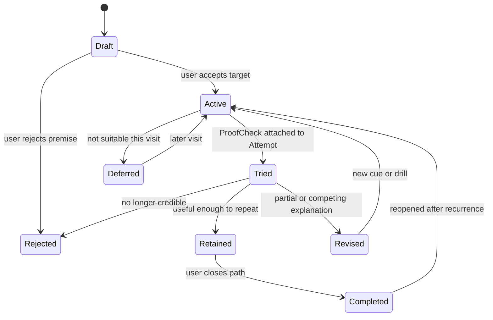

# LineWise SetterLens And TrainingPath Requirements v0

Date: 2026-08-11

Status: Active Intelligence Nursery requirements draft; not a P0 release dependency

Product: LineWise / 线感

Scope: Qualitative route interpretation, failure-linked practice, content provenance, and next-session validation

## 1. Product Outcome

SetterLens and TrainingPath should turn a route-specific difficulty into a bounded learning loop:

```text
Route evidence
  + actual Attempt / FailureEpisode
  + optional RouteRehearsal
  -> candidate route interpretation
  -> one clear MoveCue or MicroDrill
  -> next-session ProofCheck
  -> keep, revise, or reject the interpretation
```

The outcome is not “AI explains climbing.” The outcome is:

> The user understands one plausible reason a route is difficult, tries one specific adjustment or practice task, and records whether it changed the next attempt.

## 2. Boundary Between The Modules

### SetterLens

SetterLens interprets what a route may be asking from the climber.

It owns:

- route evidence and analysis provenance;
- wall and movement descriptors;
- candidate constraints and crux locations;
- body-size or style sensitivity;
- competing interpretations;
- uncertainty and evidence gaps.

It does not own:

- a guaranteed movement solution;
- official setter intent unless a setter authored the interpretation;
- a training prescription;
- medical, injury, or safety judgment.

### TrainingPath

TrainingPath turns a user-confirmed problem into a small practice sequence and later asks whether it helped.

It owns:

- the trigger and evidence behind a practice suggestion;
- selected MoveCue, MicroDrill, or teaching item;
- content provenance and scope;
- user-controlled scheduling or ordering;
- ProofCheck lifecycle and outcome.

It does not own:

- generic workout tracking;
- a large browse-first course catalog;
- automatic load, recovery, rehabilitation, or injury-prevention prescriptions;
- proof that a drill caused a send.

SetterLens can exist without TrainingPath. TrainingPath must not use an unconfirmed SetterLens inference as if it were a user fact.

## 3. Evidence Layers

Every interpretation separates these layers:

| Layer | Example | Status |
| --- | --- | --- |
| Observation | Route is on a slab; start feet are small | Observed or user-confirmed |
| User report | User felt unable to trust the left foot | User-authored |
| Reconstruction | Actual replay shows the hips moving away before the hand move | Observed, inferred, or corrected according to provenance |
| Interpretation | The route may reward weight shift before reach | Candidate explanation |
| Recommendation | Try a quiet-feet weight-shift MicroDrill | Suggested action |
| Result | User tried it and the next move felt more stable | User-confirmed outcome |

The UI must not compress these layers into one authoritative paragraph.

## 4. SetterLens Reading

A SetterLens reading is a versioned interpretation attached to a RouteCard or RouteScene.

Required fields:

| Field | Meaning |
| --- | --- |
| `subject_ref` | RouteCard and optional RouteScene/Rehearsal version |
| `authorship` | setter, coach, friend, user, model, or mixed |
| `source_evidence` | Photos, holds, Attempt, FailureEpisode, Replay, comments, or manual tags |
| `observations` | Facts or user-confirmed descriptions |
| `movement_hypotheses` | One or more candidate interpretations |
| `uncertainties` | Missing geometry, ambiguous sequence, body-size sensitivity, or weak evidence |
| `version` | Immutable reading version |
| `acceptance_state` | unresolved, accepted, edited, rejected, or superseded |

### 4.1 Analysis Dimensions

The first taxonomy should remain small and multi-select.

Wall context:

- slab;
- vertical;
- slight overhang;
- steep overhang;
- cave or roof;
- topout or mantle;
- compound or unknown.

Movement family:

- balance and weight shift;
- precise footwork;
- body tension;
- compression and opposition;
- rotation, flag, or drop knee;
- hook or toe/heel engagement;
- lock-off or reach management;
- coordination or dynamic timing;
- mantle or finish control;
- sequence and route reading;
- pacing or endurance;
- commitment or confidence;
- unknown or mixed.

Candidate constraint:

- limited usable footholds;
- directionally poor handholds;
- distance between useful contacts;
- required center-of-mass shift;
- swing or cut-loose control;
- simultaneous contact change;
- low-friction or uncertain contact;
- narrow timing window;
- deceptive sequence;
- body-size-sensitive option;
- accumulated fatigue or pacing context;
- unresolved.

The dimensions are descriptive labels, not biomechanical measurements.

### 4.2 Crux Hypothesis

A route may have zero, one, or several crux hypotheses. Each one records:

- route location or keyframe range;
- evidence used;
- candidate constraint;
- movement family;
- affected body profiles or styles, if known;
- confidence bucket;
- alternative explanation;
- what observation would change the interpretation.

“Where the user fell” and “where the route is hardest” are separate claims.

### 4.3 Authorship Rules

| Authorship | Allowed label | Required treatment |
| --- | --- | --- |
| Setter-authored | Setter note or setter intent | Verify authorship; preserve exact author/source |
| Coach-authored | Coach observation | Attribute to coach; do not relabel as setter intent |
| Friend-authored | Friend cue | Attribute and allow user acceptance/edit |
| User-authored | My read or my feeling | Treat as first-person evidence |
| Model-inferred | Inferred SetterLens | Mark suggested; show evidence and uncertainty |
| Mixed | Assisted reading | Show which parts came from whom |

Authorship is field-level when a reading combines sources.

## 5. SetterLens Experience

### Entry Points

- from a RouteCard before a new attempt;
- from a meaningful FailureEpisode during review;
- from a RouteRehearsal step;
- from Plan/Actual divergence in Compare Mode;
- from a setter, coach, or friend contribution later.

### First Screen

The first screen should show no more than:

1. one candidate route theme;
2. one likely crux or unresolved area;
3. one short explanation of why;
4. one competing interpretation when uncertainty matters;
5. the evidence and authorship label.

Detailed tags and evidence live behind expansion. SetterLens should not become a dense automatic report.

### User Corrections

The user can:

- accept, edit, reject, or leave unresolved;
- change the crux location;
- replace the primary movement family;
- add a missing alternative;
- separate “route intent” from “my personal blocker”;
- mark an interpretation as no longer applicable after a better attempt;
- preserve the prior version for comparison.

## 6. TrainingPath Trigger Contract

TrainingPath can be created from:

- a user-confirmed FailureEpisode;
- a repeated blocker across several routes;
- an accepted SetterLens reading;
- a MoveCue the user wants to practice;
- a user-selected skill focus;
- a later coach-authored recommendation.

TrainingPath must not be created solely from:

- heart rate or motion data;
- one unconfirmed model inference;
- body dimensions;
- grade alone;
- an animation feasibility warning;
- an inferred injury or limitation.

The trigger remains visible for the lifetime of the path.

## 7. TrainingPath Structure

A minimal TrainingPath contains:

| Object | Purpose |
| --- | --- |
| Trigger | Why this path exists and what evidence supports it |
| Target | One route move, movement family, or user-selected behavior |
| MoveCue | The smallest change to remember on the route |
| MicroDrill | A short on-wall practice task linked to the target |
| Optional teaching item | A short piece of sourced explanation or video |
| NextSessionCue | When and where to try the cue or drill |
| ProofCheck | What the user will observe afterward |
| Outcome history | Tried, skipped, changed, helped, unclear, or rejected |

The first path should normally contain one target and one or two actions, not a generated multi-week program.

## 8. MicroDrill Contract

A MicroDrill is route-linked practice, not a generic exercise name.

Required fields:

- title;
- target movement or behavior;
- route context or transferable context;
- short instructions;
- observable success criterion;
- source and author;
- scope and prerequisites;
- optional user-selected amount or content-authored dose;
- claim and caution text where needed;
- version and lifecycle state.

Good example:

> On two easy slab moves, pause before each hand move and confirm that the supporting foot stays quiet. Success means the foot does not readjust during the reach.

Bad examples:

- “Improve your footwork.”
- “Do three weeks of balance training.”
- “Your forearm is fatigued, so perform this recovery protocol.”

### Content Sources

Allowed early sources:

- user-authored drill;
- verified coach-authored content;
- licensed or linked third-party content;
- editorial LineWise template reviewed by a qualified climbing contributor;
- model-selected item from an approved catalog.

Model-generated training content is not promoted until its factual, instructional, and claim quality is independently evaluated. Generation must not obscure the underlying source.

## 9. ProofCheck Contract

ProofCheck is a small observation prompt attached to a later Attempt or GymVisit.

It asks one falsifiable question, for example:

- Did the left foot stay in place during the reach?
- Did shifting the hip first make the hand move feel more stable?
- Did the alternative sequence remove the same failure point?
- Was the cue remembered before the attempt?

Possible outcomes:

- not tried;
- tried, no observable change;
- tried, target behavior changed;
- tried, felt easier but behavior is unclear;
- attempt outcome improved with other changes too;
- interpretation appears wrong;
- insufficient evidence.

A send is useful evidence but does not prove the recommendation caused it.

## 10. Feedback And Revision Loop



History is append-only at the interpretation/outcome level. The current path may change, but prior evidence remains inspectable.

## 11. Module Interfaces

### SetterLens Interface

The interface accepts a bounded evidence bundle and returns versioned candidate readings.

Callers must know:

- whether the input is photo, user report, planned movement, observed movement, or a mixture;
- which versions of RouteScene, RouteRehearsal, and FailureEpisode were used;
- that several candidates may be returned;
- that no candidate becomes user-confirmed without an explicit action;
- that missing evidence is an ordinary result, not an error.

The implementation hides taxonomy mapping, retrieval, prompt/model choice, evidence weighting, and explanation formatting.

### TrainingPath Interface

The interface accepts one accepted trigger plus an approved content catalog and returns a bounded path draft.

Callers must know:

- the trigger remains attached;
- only approved content may be selected in production;
- a draft has no effect until the user activates it;
- outcomes arrive later through ProofCheck;
- physiology context can filter presentation but cannot create a medical or recovery prescription.

The implementation hides catalog search, ranking, deduplication, sequencing, and explanation generation.

### Adapter Seams

Real seams are expected for:

- local approved-content catalog and later remote catalog;
- local/manual interpreter and later model-assisted interpreter;
- in-memory test clock and production clock for due cues;
- local media references and future explicit cloud processing.

Do not expose provider-specific prompts, model IDs, or content transport shapes in the product interfaces.

## 12. Personalization Boundaries

Allowed personalization inputs:

- confirmed FailureEpisodes;
- accepted movement preferences;
- BodyProfile for reach-sensitive alternatives;
- prior MoveCue and ProofCheck outcomes;
- user-selected training focus;
- visit schedule or available session context entered by the user.

Restricted inputs:

- HealthKit and physiology data may add neutral session context only under the physiology data contract;
- BodyProfile must not become a capability judgment;
- inferred fear, pain, injury, readiness, or medical condition is prohibited;
- demographic profiling is not required for core personalization.

## 13. Safety, Claims, And Copy

Allowed language:

- “This route may reward earlier weight shift.”
- “Your last two reviewed attempts had the same user-confirmed blocker.”
- “Try this short drill and check whether the target behavior changes.”
- “This is an inferred reading based on the selected photo and sequence.”

Disallowed language:

- “This is the setter’s intended beta” without setter authorship.
- “This move is safe for your body.”
- “Your shoulder mobility is insufficient.”
- “This drill will prevent injury.”
- “Your fatigue data proves you should stop.”
- “This program will make you send the route.”

User-visible content should encourage normal gym judgment and qualified help where appropriate without turning every cue into alarmist disclaimer text.

## 14. Manual Baselines

### L0: User-Written Read

- user selects one route location;
- user writes one theme and one alternative;
- user converts it to a MoveCue;
- no model or catalog.

Question: Is the structured interpretation more useful than a plain note?

### L1: Template-Guided SetterLens

- short manual taxonomy;
- observations separated from hypotheses;
- authored provenance;
- one ProofCheck.

Question: Can the user understand and correct the analysis structure?

### L2: Catalog-Linked MicroDrill

- user-confirmed trigger;
- manually curated mapping to one MicroDrill;
- next-session cue and outcome.

Question: Does the path lead to an actual practice action?

### L3: Model-Assisted Interpretation

- model proposes one to three readings from a bounded evidence bundle;
- user corrects or rejects;
- manual baseline remains available.

Question: Does assistance add a useful interpretation or reduce authoring work?

### L4: Adaptive Path

- ProofCheck history changes the next recommendation;
- competing explanations remain available;
- no hidden training profile.

Question: Does adaptation improve decisions rather than merely vary content?

## 15. Evaluation Protocol

### SetterLens Tasks

- identify observation versus inference in a route example;
- locate a candidate crux with uncertainty;
- produce at least one plausible alternative explanation;
- explain body-size sensitivity without declaring capability;
- preserve setter, coach, user, and model authorship correctly;
- revise only affected findings after evidence changes.

### TrainingPath Tasks

- map a confirmed FailureEpisode to a bounded target;
- select one relevant approved MicroDrill;
- state an observable success criterion;
- create a next-session ProofCheck;
- handle no suitable content without fabricating a plan;
- revise or reject a path from later evidence.

### Metrics

| Metric | What it measures |
| --- | --- |
| Layer separation accuracy | Observation, inference, recommendation, and outcome remain distinct |
| Evidence coverage | Every material claim points to its supporting input or authorship |
| Alternative adequacy | Uncertainty produces a meaningful competing explanation when needed |
| User correction time | Assisted reading versus template-guided manual baseline |
| Action rate | Activated paths that lead to a real attempted cue or drill |
| ProofCheck completion | Tried paths with a later recorded observation |
| Field consequence rate | ProofChecks reporting a target behavior change, with uncertainty preserved |
| Rejection usefulness | Wrong readings can be rejected without damaging the underlying RouteCard or history |

Do not optimize send rate as the first metric. A changed attempt may still fail, and a send may have unrelated causes.

## 16. Acceptance Criteria For First Promotion

SetterLens can move beyond Nursery when:

- a user can distinguish observations from interpretations;
- at least one alternative explanation appears in ambiguous cases;
- every inferred reading shows evidence and provenance;
- correction is faster or more useful than rewriting a plain note;
- rejected interpretations do not pollute future confirmed history.

TrainingPath can move beyond Nursery when:

- every path begins with a user-confirmed trigger;
- every selected item has an approved source and visible success criterion;
- the user activates the path rather than receiving it as an automatic prescription;
- at least one ProofCheck is completed in a later real GymVisit;
- outcomes can retain, revise, or reject the underlying hypothesis;
- no physiology, medical, safety, or causal overclaim is required for value.

## 17. Failure And Pivot Rules

Pause or narrow SetterLens if:

- users cannot tell observation from interpretation;
- model text is accepted because it sounds authoritative rather than because evidence is useful;
- route photo uncertainty makes most readings generic;
- corrections require rewriting the entire analysis.

Pause or narrow TrainingPath if:

- paths are browsed but never tried;
- recommendations become a generic course feed;
- no suitable approved content exists for common triggers;
- users cannot observe the ProofCheck target;
- physiology or body data becomes a shortcut for unsupported prescriptions.

If SetterLens fails but MoveCue succeeds, keep route-specific cues and remove the interpretive report. If TrainingPath fails but ProofCheck succeeds, keep the cue-validation loop without a content pathway.

## 18. Open Decisions

- Which SetterLens dimensions belong in the first user-visible taxonomy?
- Does a route-level interpretation or a crux-level interpretation produce more useful corrections?
- Who is allowed to receive the `setter-authored` label, and how is authorship verified?
- What minimum contributor review is required for the approved MicroDrill catalog?
- Should a repeated blocker aggregate across gyms and grade systems by default or only when the user opts in?
- How long should an unresolved ProofCheck remain active?
- Can a user publish a corrected drill outcome to a friend without exposing the underlying health or body data?
- What evidence is sufficient before a model-assisted reading may rank a TrainingPath item?
